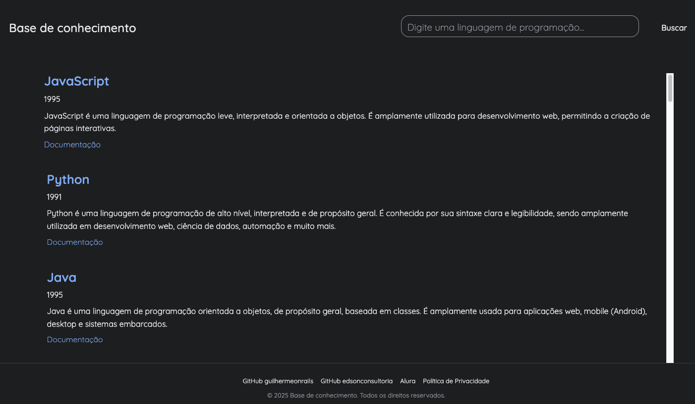

# 🚀 Galeria de Tecnologias

Este é um projeto simples de uma página web que exibe uma galeria de cards com informações sobre diversas linguagens de programação, frameworks e ferramentas de desenvolvimento. A aplicação permite filtrar e buscar tecnologias pelo nome.

Este projeto foi desenvolvido como parte dos estudos na Imersão IA da Alura + Google.

 

## ✨ Funcionalidades

- **Listagem Dinâmica**: Exibe uma coleção de tecnologias carregadas a partir de um arquivo `data.json`.
- **Busca em Tempo Real**: Filtra os cards exibidos conforme o usuário digita no campo de busca.
- **Detalhes da Tecnologia**: Cada card apresenta o nome, ano de criação, descrição e um link para a documentação oficial.
- **Design Simples e Limpo**: Interface focada na apresentação clara das informações.

## 🛠️ Tecnologias Utilizadas

- **HTML5**: Estrutura da página.
- **CSS3**: Estilização dos componentes (cards, header, etc.).
- **JavaScript (ES6+)**: Manipulação do DOM, consumo de dados via `fetch` API e implementação da lógica de busca.

## 📂 Estrutura do Projeto

```
├── data.json       # Arquivo com os dados das linguagens e ferramentas
├── index.html      # Arquivo principal da aplicação
├── README.md       # Documentação do projeto
├── script.js       # Lógica da aplicação (fetch, renderização, busca)
└── style.css       # Folha de estilos
```

## 🚀 Como Executar o Projeto

Como este projeto utiliza a `fetch` API do JavaScript para carregar um arquivo local (`data.json`), ele precisa ser executado a partir de um servidor web local para evitar problemas de CORS (Cross-Origin Resource Sharing).

1.  **Clone o repositório:**
    ```bash
    git clone https://github.com/seu-usuario/seu-repositorio.git
    ```

2.  **Navegue até o diretório do projeto:**
    ```bash
    cd seu-repositorio
    ```

3.  **Inicie um servidor local:**
    - **Usando a extensão Live Server do VS Code:**
      - Instale a extensão Live Server.
      - Clique com o botão direito no arquivo `index.html` e selecione "Open with Live Server".
    - **Usando Python (se tiver instalado):**
      ```bash
      # Para Python 3
      python -m http.server
      ```
      Acesse `http://localhost:8000` no seu navegador.

4.  Pronto! A aplicação estará rodando no seu navegador.